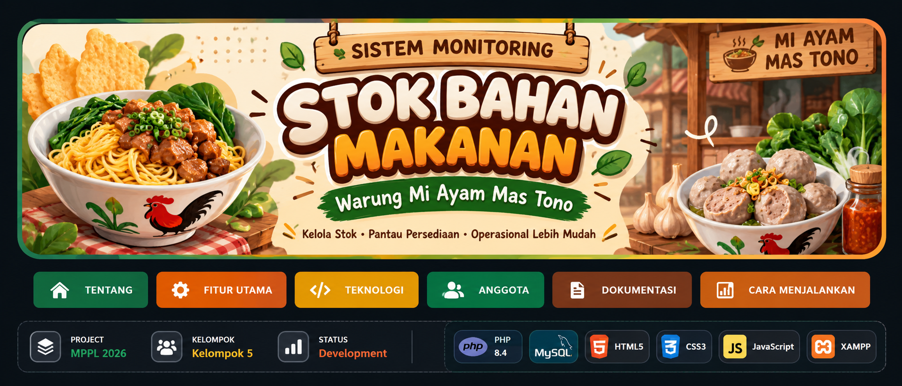

<!-- ===================================================== -->
<!--                    HEADER BANNER                     -->
<!-- ===================================================== -->

  

<!-- ===================================================== -->
<!--                  TYPING ANIMATION                    -->
<!-- ===================================================== -->

  

<!-- ===================================================== -->
<!--                     NAVIGATION                       -->
<!-- ===================================================== -->

<!-- ===================================================== -->
<!--                 PROJECT STATUS                       -->
<!-- ===================================================== -->

---

# 🍜 Sistem Monitoring Stok Bahan Makanan

### Warung Mi Ayam Mas Tono

Sistem Monitoring Stok Bahan Makanan merupakan sebuah sistem yang
dikembangkan untuk membantu **Warung Mi Ayam Mas Tono** dalam melakukan
pemantauan dan pengelolaan persediaan bahan makanan secara lebih
terstruktur.

Sistem ini dirancang untuk memenuhi tugas mata kuliah **Manajemen Proyek Perangkat
Lunak (MPPL)**.

---

## 🎯 Tujuan Project

Project ini bertujuan untuk membantu pemilik warung dalam:

- 📦 Memantau ketersediaan bahan makanan
- 📊 Mengetahui jumlah stok yang tersedia
- ⚠️ Mendeteksi bahan yang mulai menipis
- 📝 Mengelola data bahan makanan
- 🔄 Mempermudah proses pembaruan stok
- ⏱️ Mengurangi risiko kehabisan bahan saat operasional

---

## 💡 Permasalahan

Pengelolaan stok bahan makanan yang dilakukan secara manual dapat
menyebabkan beberapa permasalahan, seperti:

- Kesulitan mengetahui jumlah stok secara cepat
- Risiko kesalahan pencatatan
- Bahan makanan dapat habis tanpa diketahui
- Sulit melakukan pemantauan persediaan
- Proses pengecekan membutuhkan waktu

Oleh karena itu, dikembangkan sebuah sistem monitoring stok yang dapat
membantu proses pengelolaan persediaan secara lebih efektif.

---

## 🚀 Fitur Utama

| Fitur | Deskripsi |
|:---:|---|
| 📊 **Dashboard** | Menampilkan informasi kondisi stok bahan |
| 📦 **Data Bahan** | Mengelola data bahan makanan |
| ➕ **Tambah Stok** | Menambahkan jumlah persediaan |
| ➖ **Pengurangan Stok** | Mencatat penggunaan bahan |
| ⚠️ **Peringatan Stok** | Memberikan informasi ketika stok menipis |
| 🔍 **Monitoring** | Memantau kondisi persediaan |
| 📝 **Pencatatan** | Mencatat perubahan stok |

---

## 🏪 Studi Kasus

### Warung Mi Ayam Mas Tono

Beberapa bahan yang menjadi bagian dari sistem monitoring antara lain:

| 🥘 Bahan | 📦 Contoh Penggunaan |
|---|---|
| 🍜 Mie | Bahan utama mi ayam |
| 🍗 Ayam | Topping mi ayam |
| 🥬 Sawi | Pelengkap |
| 🧂 Bumbu | Bahan penyedap |
| 🥚 Telur | Bahan pelengkap |
| 🌿 Daun bawang | Pelengkap |

# 👥 Anggota Kelompok

| No. | Nama | NIM |
|:---:|---|:---:|
| 1 | **Syahid Al Hakim** | `230504051` |
| 2 | **Mahesa Kayan** | `230504040` |
| 3 | **Nur Atikah** | `230504054` |
| 4 | **Jelita aprilia anas tasya** | `230504033` |
