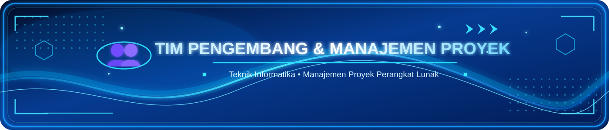

<!-- ===================================================== -->
<!--                    HEADER BANNER                     -->
<!-- ===================================================== -->

  

<!-- ===================================================== -->
<!--                  TYPING ANIMATION                    -->
<!-- ===================================================== -->

  

<!-- ===================================================== -->
<!--                     NAVIGATION                       -->
<!-- ===================================================== -->

<!-- ===================================================== -->
<!--                 PROJECT STATUS                       -->
<!-- ===================================================== -->

  

# 🍜 Sistem Monitoring Stok Bahan Makanan 

<h2> Warung Mi Ayam Mas Tono </h2>

Sistem Monitoring Stok Bahan Makanan merupakan sebuah sistem berbasis konsep **Digital Twin** yang dikembangkan untuk merepresentasikan kondisi fisik stok bahan makanan secara digital dan aktual di **Warung Mi Ayam Mas Tono**.

Sistem ini dirancang untuk memenuhi tugas mata kuliah **Manajemen Proyek Perangkat Lunak (MPPL)**, mengatasi permasalahan pencatatan manual, mencegah kehabisan stok saat jam sibuk penjualan, menghindari persediaan berlebih yang basi, serta menyediakan transparansi pengadaan bahan bagi pemilik usaha.

---

  

<h2>🎯 Konsep Digital Twin pada Sistem </h2>

Konsep **Digital Twin** dalam aplikasi ini diterapkan sebagai representasi virtual dari kondisi fisik rak dan persediaan bahan makanan di Warung Mie Ayam Mas Tono:
- **Sinkronisasi Dinamis:** Setiap transaksi stok masuk (*penerimaan dari pasar/supplier*) dan stok keluar (*pemakaian memasak harian*) secara otomatis memperbarui representasi kembar digital secara instan.
- **Visualisasi Status Fisik:** Menggunakan indikator level persentase buffer dan skema visual (*Aman*, *Menipis*, *Kritis/Habis*) untuk merefleksikan volume fisik secara intuitif.
- **Peringatan Ambang Batas Otomatis (*Buffer Threshold*):** Notifikasi dini ketika stok menyentuh atau berada di bawah batas minimum (*safety stock*).

---

  

<h2>💡 Permasalahan </h2>

Pengelolaan stok bahan makanan yang dilakukan secara manual dapat menyebabkan beberapa permasalahan, seperti:

- Kesulitan mengetahui jumlah stok secara cepat
- Risiko kesalahan pencatatan pembukuan manual
- Bahan makanan dapat habis tiba-tiba tanpa diketahui saat warung ramai
- Sulit melakukan pemantauan persediaan dan estimasi nilai aset bahan
- Proses pengecekan fisik membutuhkan waktu dan tenaga

Oleh karena itu, dikembangkan sebuah sistem monitoring stok berbasis Digital Twin yang dapat membantu proses pengelolaan persediaan secara lebih efektif dan efisien.

  

<h2>🎯 Tujuan Project </h2>

Project ini bertujuan untuk membantu pemilik warung dalam:

- 📦 Memantau ketersediaan bahan makanan secara real-time
- 📊 Mengetahui jumlah stok fisik aktual yang tersedia
- ⚠️ Mendeteksi dini bahan yang mulai menipis melalui buffer alert
- 📝 Mengelola data bahan makanan, kategori, dan batas minimum
- 🔄 Mempermudah proses pencatatan stok masuk dan keluar
- ⏱️ Mengurangi risiko kehabisan bahan saat operasional jam sibuk warung

  

<h2> 🏪 Studi Kasus </h2>

### Warung Mi Ayam Mas Tono

Beberapa bahan yang menjadi bagian dari sistem monitoring antara lain:

| 🥘 Bahan | 📦 Contoh Penggunaan | Satuan |
|---|---|:---:|
| 🍜 **Mie Basah** | Bahan utama mi ayam | kg |
| 🍗 **Daging Ayam** | Topping utama mi ayam | kg |
| 🥬 **Sawi Hijau** | Sayuran pelengkap | ikat |
| 🌿 **Daun Bawang** | Pelengkap aromatik | ikat |
| 🧂 **Minyak & Bumbu Racik** | Bahan penyedap dan kuah | liter / botol |
| 🥚 **Telur Puyuh / Ayam** | Bahan pelengkap tambahan | butir |
| 🥟 **Kulit Pangsit** | Pangsit goreng / rebus | bungkus |

  

<h2>🚀 Fitur Utama </h2>

| Fitur | Deskripsi |
|:---:|---|
| 📊 **Dashboard Digital Twin** | Visualisasi kondisi stok bahan dengan indikator kapasitas dan peringatan stok menipis |
| 📦 **Data Bahan (CRUD)** | Mengelola data bahan makanan, kategori, satuan, harga, dan batas minimum stok |
| 📥 **Pencatatan Stok Masuk** | Mencatat pasokan penerimaan bahan dari pasar dan otomatis memperbarui stok fisik |
| 📤 **Pencatatan Stok Keluar** | Mencatat pemakaian bahan masak dengan validasi ketat ketersediaan stok |
| ⚠️ **Monitoring Buffer & Peringatan** | Indikator visual level aman, menipis, atau kritis dengan rekomendasi restock proaktif |
| 📋 **Log Riwayat (Audit Trail)** | Rekaman kronologis dari seluruh mutasi dan aktivitas sistem secara transparan |
| 📑 **Laporan & Cetak Dokumen** | Rekapitulasi mutasi dan valuasi persediaan siap cetak formal / export PDF |

  

<h2>🛠️ Technology Stack</h2>

<picture>
  <source media="(prefers-color-scheme: dark)" srcset="https://cdn.simpleicons.org/github/ffffff">
  
</picture>

<table>
  <thead>
    <tr>
      <th>Teknologi</th>
      <th>Nama</th>
      <th>Fungsi</th>
    </tr>
  </thead>
  <tbody>
    <tr>
      <td>Backend Framework</td>
      <td>
        <a href="https://codeigniter.com/userguide3/" target="_blank">
          <b>CodeIgniter 3</b>
        </a>
      </td>
      <td>Framework PHP untuk mengelola controller, model, routing, dan logika aplikasi.</td>
    </tr>
    <tr>
      <td>Programming Language</td>
      <td>
        <a href="https://www.php.net/" target="_blank">
          <b>PHP</b>
        </a>
      </td>
      <td>Memproses data dan menjalankan logika aplikasi pada sisi server.</td>
    </tr>
    <tr>
      <td>Database</td>
      <td>
        <a href="https://www.mysql.com/" target="_blank">
          <b>MySQL</b>
        </a>
      </td>
      <td>Menyimpan data stok bahan makanan, transaksi, dan informasi terkait.</td>
    </tr>
    <tr>
      <td>Frontend</td>
      <td>
        <a href="https://developer.mozilla.org/en-US/docs/Web/HTML" target="_blank">
          <b>HTML5</b>
        </a>
      </td>
      <td>Menyusun struktur halaman antarmuka aplikasi.</td>
    </tr>
    <tr>
      <td>Styling</td>
      <td>
        <a href="https://developer.mozilla.org/en-US/docs/Web/CSS" target="_blank">
          <b>CSS3</b>
        </a>
      </td>
      <td>Mengatur tampilan, warna, tata letak, dan desain antarmuka.</td>
    </tr>
    <tr>
      <td>Frontend Scripting</td>
      <td>
        <a href="https://developer.mozilla.org/en-US/docs/Web/JavaScript" target="_blank">
          <b>JavaScript</b>
        </a>
      </td>
      <td>Menambahkan interaksi dan fungsi dinamis pada halaman aplikasi.</td>
    </tr>
    <tr>
      <td>Local Server</td>
      <td>
        <a href="https://www.apachefriends.org/" target="_blank">
          <b>XAMPP</b>
        </a>
      </td>
      <td>Menjalankan server web dan database secara lokal selama pengembangan.</td>
    </tr>
    <tr>
      <td>Version Control</td>
      <td>
        <a href="https://git-scm.com/" target="_blank">
          <b>Git</b>
        </a>
      </td>
      <td>Mencatat perubahan kode dan membantu kolaborasi pengembangan.</td>
    </tr>
    <tr>
      <td>Code Repository</td>
      <td>
        <a href="https://github.com/" target="_blank">
          <b>GitHub</b>
        </a>
      </td>
      <td>Menyimpan kode sumber dan memfasilitasi kolaborasi antaranggota tim.</td>
    </tr>
    <tr>
      <td>Code Editor</td>
      <td>
        <a href="https://code.visualstudio.com/" target="_blank">
          <b>Visual Studio Code</b>
        </a>
      </td>
      <td>Editor untuk menulis, mengelola, dan memperbaiki kode program.</td>
    </tr>
  </tbody>
</table>

<h2>👥 Tim Pengembang (Kelompok 5) </h2>

  

<table align="center">
  <tr>
    <th>No.</th>
    <th>Nama Anggota</th>
    <th>NIM</th>
    <th>Peran dalam Proyek</th>
  </tr>
  <tr>
    <td align="center">01</td>
    <td><b>Syahid Al Hakim</b></td>
    <td align="center"><code>230504051</code></td>
    <td align="center">👑 <b>Ketua</b></td>
  </tr>
  <tr>
    <td align="center">02</td>
    <td><b>Nur Atikah</b></td>
    <td align="center"><code>230504054</code></td>
    <td align="center">⭐ <b>Wakil</b></td>
  </tr>
  <tr>
    <td align="center">03</td>
    <td><b>Mahesa Kayan</b></td>
    <td align="center"><code>230504040</code></td>
    <td align="center">👤 <b>Anggota</b></td>
  </tr>
  <tr>
    <td align="center">04</td>
    <td><b>Jelita Aprilia Anas Tasya</b></td>
    <td align="center"><code>230504033</code></td>
    <td align="center">👤 <b>Anggota</b></td>
  </tr>
</table>

**Mata Kuliah:** Manajemen Proyek Perangkat Lunak (MPPL)  
**Dosen Pengampu:** Cut Alna Fadhilla, S.Kom., M.Sc  
**Program Studi:** S1 Informatika — Fakultas Sains dan Teknologi  
**Instansi:** Universitas Samudra, Langsa (2026)

  

<h2>🏪 Mitra UMKM </h2>

<table align="center">
  <tr>
    <td><b>🏪 Pemilik / Sponsor UMKM</b></td>
    <td><b>Dalu Meriana</b></td>
  </tr>
  <tr>
    <td><b>🍜 Nama Usaha</b></td>
    <td><b>Warung Mie Ayam Mastono</b></td>
  </tr>
  <tr>
    <td><b>📍 Lokasi Usaha</b></td>
    <td>Jl. Syiah Kuala No. 102, Pb. Blang Pase, 
    Langsa Kota, Kota Langsa, Aceh</td>
  </tr>
</table>

  

<h2> 📄 Lisensi & Hak Cipta </h2>

Dikembangkan oleh **Kelompok 5 MPPL 2026** - Program Studi Informatika, Universitas Samudra. Didedikasikan untuk kemajuan operasional UMKM **Warung Mie Ayam Mastono**.
