<!-- ===================================================== -->
<!--                    HEADER BANNER                     -->
<!-- ===================================================== -->

  

<!-- ===================================================== -->
<!--                  TYPING ANIMATION                    -->
<!-- ===================================================== -->

  

<!-- ===================================================== -->
<!--                     NAVIGATION                       -->
<!-- ===================================================== -->

<!-- ===================================================== -->
<!--                 PROJECT STATUS                       -->
<!-- ===================================================== -->

---

# 🍜 Sistem Monitoring Stok Bahan Makanan 

### Warung Mi Ayam Mas Tono

Sistem Monitoring Stok Bahan Makanan merupakan sebuah sistem berbasis konsep **Digital Twin** yang dikembangkan untuk merepresentasikan kondisi fisik stok bahan makanan secara digital dan aktual di **Warung Mi Ayam Mas Tono**.

Sistem ini dirancang untuk memenuhi tugas mata kuliah **Manajemen Proyek Perangkat Lunak (MPPL)**, mengatasi permasalahan pencatatan manual, mencegah kehabisan stok saat jam sibuk penjualan, menghindari persediaan berlebih yang basi, serta menyediakan transparansi pengadaan bahan bagi pemilik usaha.

---

## 🎯 Konsep Digital Twin pada Sistem

Konsep **Digital Twin** dalam aplikasi ini diterapkan sebagai representasi virtual dari kondisi fisik rak dan persediaan bahan makanan di Warung Mie Ayam Mas Tono:
- **Sinkronisasi Dinamis:** Setiap transaksi stok masuk (*penerimaan dari pasar/supplier*) dan stok keluar (*pemakaian memasak harian*) secara otomatis memperbarui representasi kembar digital secara instan.
- **Visualisasi Status Fisik:** Menggunakan indikator level persentase buffer dan skema visual (*Aman*, *Menipis*, *Kritis/Habis*) untuk merefleksikan volume fisik secara intuitif.
- **Peringatan Ambang Batas Otomatis (*Buffer Threshold*):** Notifikasi dini ketika stok menyentuh atau berada di bawah batas minimum (*safety stock*).

---

## 🎯 Tujuan Project

Project ini bertujuan untuk membantu pemilik warung dalam:

- 📦 Memantau ketersediaan bahan makanan secara real-time
- 📊 Mengetahui jumlah stok fisik aktual yang tersedia
- ⚠️ Mendeteksi dini bahan yang mulai menipis melalui buffer alert
- 📝 Mengelola data bahan makanan, kategori, dan batas minimum
- 🔄 Mempermudah proses pencatatan stok masuk dan keluar
- ⏱️ Mengurangi risiko kehabisan bahan saat operasional jam sibuk warung

---

## 💡 Permasalahan

Pengelolaan stok bahan makanan yang dilakukan secara manual dapat menyebabkan beberapa permasalahan, seperti:

- Kesulitan mengetahui jumlah stok secara cepat
- Risiko kesalahan pencatatan pembukuan manual
- Bahan makanan dapat habis tiba-tiba tanpa diketahui saat warung ramai
- Sulit melakukan pemantauan persediaan dan estimasi nilai aset bahan
- Proses pengecekan fisik membutuhkan waktu dan tenaga

Oleh karena itu, dikembangkan sebuah sistem monitoring stok berbasis Digital Twin yang dapat membantu proses pengelolaan persediaan secara lebih efektif dan efisien.

---

## 🏪 Studi Kasus

### Warung Mi Ayam Mas Tono

Beberapa bahan yang menjadi bagian dari sistem monitoring antara lain:

| 🥘 Bahan | 📦 Contoh Penggunaan | Satuan |
|---|---|:---:|
| 🍜 **Mie Basah** | Bahan utama mi ayam | kg |
| 🍗 **Daging Ayam** | Topping utama mi ayam | kg |
| 🥬 **Sawi Hijau** | Sayuran pelengkap | ikat |
| 🌿 **Daun Bawang** | Pelengkap aromatik | ikat |
| 🧂 **Minyak & Bumbu Racik** | Bahan penyedap dan kuah | liter / botol |
| 🥚 **Telur Puyuh / Ayam** | Bahan pelengkap tambahan | butir |
| 🥟 **Kulit Pangsit** | Pangsit goreng / rebus | bungkus |

---

## 🚀 Fitur Utama

| Fitur | Deskripsi |
|:---:|---|
| 📊 **Dashboard Digital Twin** | Visualisasi kondisi stok bahan dengan indikator kapasitas dan peringatan stok menipis |
| 📦 **Data Bahan (CRUD)** | Mengelola data bahan makanan, kategori, satuan, harga, dan batas minimum stok |
| 📥 **Pencatatan Stok Masuk** | Mencatat pasokan penerimaan bahan dari pasar dan otomatis memperbarui stok fisik |
| 📤 **Pencatatan Stok Keluar** | Mencatat pemakaian bahan masak dengan validasi ketat ketersediaan stok |
| ⚠️ **Monitoring Buffer & Peringatan** | Indikator visual level aman, menipis, atau kritis dengan rekomendasi restock proaktif |
| 📋 **Log Riwayat (Audit Trail)** | Rekaman kronologis dari seluruh mutasi dan aktivitas sistem secara transparan |
| 📑 **Laporan & Cetak Dokumen** | Rekapitulasi mutasi dan valuasi persediaan siap cetak formal / export PDF |

---

## 👥 Tim Pengembang (Kelompok 5)

**Mata Kuliah:** Manajemen Proyek Perangkat Lunak (MPPL)  
**Dosen Pengampu:** Cut Alna Fadhilla, S.Kom., M.Sc  
**Program Studi:** S1 Informatika — Fakultas Sains dan Teknologi  
**Instansi:** Universitas Samudra, Langsa (2026)

| No. | Nama Anggota | NIM | Peran dalam Proyek |
|:---:|:---|:---:|:---|
| 1 | **Syahid Al Hakim** | `230504051` |
| 2 | **Nur Atikah** | `230504054` |
| 3 | **Mahesa Kayan** | `230504040` |
| 4 | **Jelita Aprilia Anas Tasya** | `230504033` | 
**Pemilik / Sponsor UMKM:** Dalu Meriana (*Warung Mie Ayam Mastono*)  
**Lokasi Usaha:** Jl. Syiah Kuala No 102, Pb. Blang Pase, Langsa Kota, Kota Langsa, Aceh.

---

## 📄 Lisensi & Hak Cipta

Dikembangkan oleh **Kelompok 5 MPPL 2026** - Program Studi Informatika, Universitas Samudra. Didedikasikan untuk kemajuan operasional UMKM **Warung Mie Ayam Mastono**.
